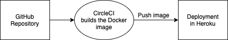

# Chart App
This is a repository for simple vue.js chart app. The app runs in a Docker container that is hosted by Heroku. In this project I used CircleCI continuous integration to achieve easy deployment to Heroku.

## CircleCI pipeline setup
The following automatic workflow is triggered by every `git push` and also once a day to update the chart data.



To achieve this you have to setup project in [CircleCI](https://circleci.com/) and create `.circleci/config.yml` file. You also have to set up an App in [Heroku](https://heroku.com/) and add your Heroku credentials in CircleCI to the project environment variables. The app uses a custom Docker image that is specified in `Dockerfile`.

## Local setup
You can also run this app locally to view it at http://localhost:8080/. There are two ways. The normal way is best for development purposes but it is also possible to run containerized version of the app locally.

**Normal way:**
```
npm install
npm run serve # Compiles and hot-reloads for development
npm run build # Compiles and minifies for production
```

**Containerized:**
```
docker build -t chart-app .
docker run -p 8080:8080 chart-app
```

## References
These, [tuturial 1](https://alligator.io/vuejs/vue-chart-js/) & [tutorial 2](https://medium.com/@elvismiranda213/creating-stunning-charts-with-vue-js-and-chart-js-c309c87a0077), were helpful when building the chart.
